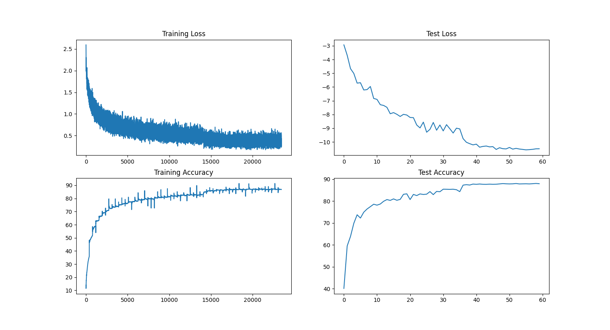

# ai-era-assignment8
Assignment 8

# Steps to Run Locally
1. Create and activate a virtual environment:
   ```bash
   python -m venv venv
   source venv/bin/activate  # On Windows: venv\Scripts\activate
   ```

2. Install dependencies:
   ```bash
   pip install -r requirements.txt
   ```

3. Run tests:
   ```bash
   pytest tests/
   ```

4. Train model:
   ```bash
   python src/train.py
   ```

# To deploy to GitHub
1. Create a new GitHub repository
2. Initialize git in your local project:
   ```bash
   git init
   ```
3. Push your code to the new repository:
   ```bash
   git remote add origin https://github.com/your-username/your-repo.git
   git branch -M main
   git add .
   git commit -m "Initial commit"
   git push -u origin main
   ```

4. The GitHub Actions workflow will automatically trigger when you push to the repository. It will:
   - Set up the Python environment
   - Install dependencies
   - Run all tests to verify:
     - Model validity
     - Parameter count


# Training Logs
```
[INFO] Using device: mps
[STEP 1/5] Preparing datasets...
/Users/gitesh.grover/Study/AI-ERA/ai-era-assignment8/src/train.py:67: UserWarning: Argument 'fill_value' is not valid and will be ignored.
  A.CoarseDropout(max_holes=1, max_height=16, max_width=16, min_holes=1, min_height=16, min_width=16, fill_value=mean, mask_fill_value = None),
/Users/gitesh.grover/Study/AI-ERA/ai-era-assignment8/src/train.py:67: UserWarning: Argument 'mask_fill_value' is not valid and will be ignored.
  A.CoarseDropout(max_holes=1, max_height=16, max_width=16, min_holes=1, min_height=16, min_width=16, fill_value=mean, mask_fill_value = None),
Files already downloaded and verified
Files already downloaded and verified
[INFO] Dataloader arguments: {'shuffle': True, 'batch_size': 128, 'num_workers': 10, 'pin_memory': True}
[INFO] Total training batches: 391
[INFO] Batch size: 128
[INFO] Training samples: 50000
[INFO] Test samples: 10000

[STEP 2/5] Initializing model...
----------------------------------------------------------------
        Layer (type)               Output Shape         Param #
================================================================
            Conv2d-1           [-1, 32, 32, 32]             864
       BatchNorm2d-2           [-1, 32, 32, 32]              64
            Conv2d-3           [-1, 32, 32, 32]             288
            Conv2d-4           [-1, 32, 32, 32]           1,024
       BatchNorm2d-5           [-1, 32, 32, 32]              64
            Conv2d-6           [-1, 32, 32, 32]           9,216
       BatchNorm2d-7           [-1, 32, 32, 32]              64
        BasicBlock-8           [-1, 32, 32, 32]               0
            Conv2d-9           [-1, 32, 32, 32]             288
           Conv2d-10           [-1, 32, 32, 32]           1,024
      BatchNorm2d-11           [-1, 32, 32, 32]              64
           Conv2d-12           [-1, 32, 32, 32]           9,216
      BatchNorm2d-13           [-1, 32, 32, 32]              64
       BasicBlock-14           [-1, 32, 32, 32]               0
           Conv2d-15           [-1, 32, 16, 16]             288
           Conv2d-16           [-1, 32, 16, 16]           1,024
      BatchNorm2d-17           [-1, 32, 16, 16]              64
           Conv2d-18           [-1, 32, 16, 16]           9,216
      BatchNorm2d-19           [-1, 32, 16, 16]              64
           Conv2d-20           [-1, 32, 16, 16]           1,024
      BatchNorm2d-21           [-1, 32, 16, 16]              64
       BasicBlock-22           [-1, 32, 16, 16]               0
           Conv2d-23           [-1, 32, 16, 16]             288
           Conv2d-24           [-1, 32, 16, 16]           1,024
      BatchNorm2d-25           [-1, 32, 16, 16]              64
           Conv2d-26           [-1, 32, 16, 16]           9,216
      BatchNorm2d-27           [-1, 32, 16, 16]              64
       BasicBlock-28           [-1, 32, 16, 16]               0
           Conv2d-29           [-1, 32, 16, 16]             288
           Conv2d-30           [-1, 32, 16, 16]           1,024
      BatchNorm2d-31           [-1, 32, 16, 16]              64
           Conv2d-32           [-1, 32, 16, 16]           9,216
      BatchNorm2d-33           [-1, 32, 16, 16]              64
       BasicBlock-34           [-1, 32, 16, 16]               0
           Conv2d-35             [-1, 32, 8, 8]             288
           Conv2d-36             [-1, 32, 8, 8]           1,024
      BatchNorm2d-37             [-1, 32, 8, 8]              64
           Conv2d-38             [-1, 32, 8, 8]           9,216
      BatchNorm2d-39             [-1, 32, 8, 8]              64
           Conv2d-40             [-1, 32, 8, 8]           1,024
      BatchNorm2d-41             [-1, 32, 8, 8]              64
       BasicBlock-42             [-1, 32, 8, 8]               0
           Conv2d-43             [-1, 32, 8, 8]             288
           Conv2d-44             [-1, 32, 8, 8]           1,024
      BatchNorm2d-45             [-1, 32, 8, 8]              64
           Conv2d-46             [-1, 32, 8, 8]           9,216
      BatchNorm2d-47             [-1, 32, 8, 8]              64
       BasicBlock-48             [-1, 32, 8, 8]               0
           Conv2d-49             [-1, 32, 8, 8]             288
           Conv2d-50             [-1, 32, 8, 8]           1,024
      BatchNorm2d-51             [-1, 32, 8, 8]              64
           Conv2d-52             [-1, 32, 8, 8]           9,216
      BatchNorm2d-53             [-1, 32, 8, 8]              64
       BasicBlock-54             [-1, 32, 8, 8]               0
           Conv2d-55             [-1, 32, 4, 4]             288
           Conv2d-56             [-1, 32, 4, 4]           1,024
      BatchNorm2d-57             [-1, 32, 4, 4]              64
           Conv2d-58             [-1, 32, 4, 4]           9,216
      BatchNorm2d-59             [-1, 32, 4, 4]              64
           Conv2d-60             [-1, 32, 4, 4]           1,024
      BatchNorm2d-61             [-1, 32, 4, 4]              64
       BasicBlock-62             [-1, 32, 4, 4]               0
           Conv2d-63             [-1, 32, 4, 4]             288
           Conv2d-64             [-1, 32, 4, 4]           1,024
      BatchNorm2d-65             [-1, 32, 4, 4]              64
           Conv2d-66             [-1, 32, 4, 4]           9,216
      BatchNorm2d-67             [-1, 32, 4, 4]              64
       BasicBlock-68             [-1, 32, 4, 4]               0
           Conv2d-69             [-1, 32, 4, 4]             288
           Conv2d-70             [-1, 32, 4, 4]           1,024
      BatchNorm2d-71             [-1, 32, 4, 4]              64
           Conv2d-72             [-1, 32, 4, 4]           9,216
      BatchNorm2d-73             [-1, 32, 4, 4]              64
       BasicBlock-74             [-1, 32, 4, 4]               0
           Conv2d-75             [-1, 32, 4, 4]             288
           Conv2d-76             [-1, 32, 4, 4]           1,024
      BatchNorm2d-77             [-1, 32, 4, 4]              64
           Conv2d-78             [-1, 32, 4, 4]           9,216
      BatchNorm2d-79             [-1, 32, 4, 4]              64
       BasicBlock-80             [-1, 32, 4, 4]               0
           Linear-81                   [-1, 10]             330
================================================================
Total params: 132,394
Trainable params: 132,394
Non-trainable params: 0
----------------------------------------------------------------
Input size (MB): 0.01
Forward/backward pass size (MB): 5.16
Params size (MB): 0.51
Estimated Total Size (MB): 5.68
----------------------------------------------------------------
/Users/gitesh.grover/Study/AI-ERA/venv/lib/python3.9/site-packages/torch/optim/lr_scheduler.py:62: UserWarning: The verbose parameter is deprecated. Please use get_last_lr() to access the learning rate.
  warnings.warn(
[STEP 3/5] Starting training and Testing...

[INFO] Training of Epoch 1 started...
Epoch 1: 100%|█████████████████████████████████████████████████| 391/391 [01:19<00:00,  4.94it/s, loss=1.719, accuracy=36.01%]
[INFO] Training of Epoch 1 completed in 79.20 seconds
[INFO] Evaluating model...
Current learning rate: 0.1
Test Accuracy: 44.36%

[INFO] Training of Epoch 2 started...
Epoch 2: 100%|█████████████████████████████████████████████████| 391/391 [01:20<00:00,  4.87it/s, loss=1.333, accuracy=51.12%]
[INFO] Training of Epoch 2 completed in 229.07 seconds
[INFO] Evaluating model...
Current learning rate: 0.1
Test Accuracy: 59.50%

[INFO] Training of Epoch 3 started...
Epoch 3: 100%|█████████████████████████████████████████████████| 391/391 [01:19<00:00,  4.95it/s, loss=1.140, accuracy=58.86%]
[INFO] Training of Epoch 3 completed in 378.14 seconds
[INFO] Evaluating model...
Current learning rate: 0.1
Test Accuracy: 65.55%

[INFO] Training of Epoch 4 started...
Epoch 4: 100%|█████████████████████████████████████████████████| 391/391 [01:19<00:00,  4.91it/s, loss=1.020, accuracy=63.59%]
[INFO] Training of Epoch 4 completed in 526.61 seconds
[INFO] Evaluating model...
Current learning rate: 0.1
Test Accuracy: 67.44%

[INFO] Training of Epoch 5 started...
Epoch 5: 100%|█████████████████████████████████████████████████| 391/391 [01:20<00:00,  4.88it/s, loss=0.930, accuracy=67.16%]
[INFO] Training of Epoch 5 completed in 676.08 seconds
[INFO] Evaluating model...
Current learning rate: 0.1
Test Accuracy: 69.48%

[INFO] Training of Epoch 6 started...
Epoch 6: 100%|█████████████████████████████████████████████████| 391/391 [01:20<00:00,  4.87it/s, loss=0.863, accuracy=69.48%]
[INFO] Training of Epoch 6 completed in 827.32 seconds
[INFO] Evaluating model...
Current learning rate: 0.1
Test Accuracy: 75.38%

[INFO] Training of Epoch 7 started...
Epoch 7: 100%|█████████████████████████████████████████████████| 391/391 [01:20<00:00,  4.83it/s, loss=0.816, accuracy=71.20%]
[INFO] Training of Epoch 7 completed in 977.60 seconds
[INFO] Evaluating model...
Current learning rate: 0.1
Test Accuracy: 74.04%

[INFO] Training of Epoch 8 started...
Epoch 8: 100%|█████████████████████████████████████████████████| 391/391 [01:21<00:00,  4.81it/s, loss=0.779, accuracy=72.60%]
[INFO] Training of Epoch 8 completed in 1130.06 seconds
[INFO] Evaluating model...
Current learning rate: 0.1
Test Accuracy: 75.83%

[INFO] Training of Epoch 9 started...
Epoch 9: 100%|█████████████████████████████████████████████████| 391/391 [01:19<00:00,  4.94it/s, loss=0.752, accuracy=73.73%]
[INFO] Training of Epoch 9 completed in 1280.00 seconds
[INFO] Evaluating model...
Current learning rate: 0.1
Test Accuracy: 75.74%

[INFO] Training of Epoch 10 started...
Epoch 10: 100%|████████████████████████████████████████████████| 391/391 [01:22<00:00,  4.74it/s, loss=0.722, accuracy=74.73%]
[INFO] Training of Epoch 10 completed in 1430.66 seconds
[INFO] Evaluating model...
Current learning rate: 0.1
Test Accuracy: 79.07%

[INFO] Training of Epoch 11 started...
Epoch 11: 100%|████████████████████████████████████████████████| 391/391 [01:20<00:00,  4.85it/s, loss=0.698, accuracy=75.58%]
[INFO] Training of Epoch 11 completed in 1582.64 seconds
[INFO] Evaluating model...
Current learning rate: 0.1
Test Accuracy: 77.47%

[INFO] Training of Epoch 12 started...
Epoch 12: 100%|████████████████████████████████████████████████| 391/391 [01:20<00:00,  4.86it/s, loss=0.680, accuracy=76.19%]
[INFO] Training of Epoch 12 completed in 1731.41 seconds
[INFO] Evaluating model...
Current learning rate: 0.1
Test Accuracy: 78.53%

[INFO] Training of Epoch 13 started...
Epoch 13: 100%|████████████████████████████████████████████████| 391/391 [01:20<00:00,  4.86it/s, loss=0.666, accuracy=76.52%]
[INFO] Training of Epoch 13 completed in 1881.49 seconds
[INFO] Evaluating model...
Current learning rate: 0.1
Test Accuracy: 76.55%

[INFO] Training of Epoch 14 started...
Epoch 14: 100%|████████████████████████████████████████████████| 391/391 [01:21<00:00,  4.78it/s, loss=0.647, accuracy=77.40%]
[INFO] Training of Epoch 14 completed in 2035.10 seconds
[INFO] Evaluating model...
Current learning rate: 0.1
Test Accuracy: 80.62%

[INFO] Training of Epoch 15 started...
Epoch 15: 100%|████████████████████████████████████████████████| 391/391 [01:21<00:00,  4.81it/s, loss=0.631, accuracy=77.86%]
[INFO] Training of Epoch 15 completed in 2186.57 seconds
[INFO] Evaluating model...
Current learning rate: 0.1
Test Accuracy: 79.71%

[INFO] Training of Epoch 16 started...
Epoch 16: 100%|████████████████████████████████████████████████| 391/391 [01:21<00:00,  4.80it/s, loss=0.623, accuracy=78.05%]
[INFO] Training of Epoch 16 completed in 2337.46 seconds
[INFO] Evaluating model...
Current learning rate: 0.1
Test Accuracy: 79.92%

[INFO] Training of Epoch 17 started...
Epoch 17: 100%|████████████████████████████████████████████████| 391/391 [01:21<00:00,  4.81it/s, loss=0.615, accuracy=78.22%]
[INFO] Training of Epoch 17 completed in 2487.65 seconds
[INFO] Evaluating model...
Current learning rate: 0.1
Test Accuracy: 81.64%

[INFO] Training of Epoch 18 started...
Epoch 18: 100%|████████████████████████████████████████████████| 391/391 [01:19<00:00,  4.91it/s, loss=0.596, accuracy=79.07%]
[INFO] Training of Epoch 18 completed in 2636.57 seconds
[INFO] Evaluating model...
Current learning rate: 0.1
Test Accuracy: 82.09%

[INFO] Training of Epoch 19 started...
Epoch 19: 100%|████████████████████████████████████████████████| 391/391 [01:20<00:00,  4.86it/s, loss=0.586, accuracy=79.55%]
[INFO] Training of Epoch 19 completed in 2785.60 seconds
[INFO] Evaluating model...
Current learning rate: 0.1
Test Accuracy: 81.37%

[INFO] Training of Epoch 20 started...
Epoch 20: 100%|████████████████████████████████████████████████| 391/391 [01:20<00:00,  4.85it/s, loss=0.577, accuracy=79.88%]
[INFO] Training of Epoch 20 completed in 2936.89 seconds
[INFO] Evaluating model...
Current learning rate: 0.1
Test Accuracy: 83.17%

[INFO] Training of Epoch 21 started...
Epoch 21: 100%|████████████████████████████████████████████████| 391/391 [01:20<00:00,  4.86it/s, loss=0.568, accuracy=80.21%]
[INFO] Training of Epoch 21 completed in 3086.60 seconds
[INFO] Evaluating model...
Current learning rate: 0.1
Test Accuracy: 82.14%

[INFO] Training of Epoch 22 started...
Epoch 22: 100%|████████████████████████████████████████████████| 391/391 [01:20<00:00,  4.85it/s, loss=0.563, accuracy=80.26%]
[INFO] Training of Epoch 22 completed in 3236.76 seconds
[INFO] Evaluating model...
Current learning rate: 0.1
Test Accuracy: 83.83%

[INFO] Training of Epoch 23 started...
Epoch 23: 100%|████████████████████████████████████████████████| 391/391 [01:20<00:00,  4.85it/s, loss=0.556, accuracy=80.48%]
[INFO] Training of Epoch 23 completed in 3387.13 seconds
[INFO] Evaluating model...
Current learning rate: 0.1
Test Accuracy: 80.81%

[INFO] Training of Epoch 24 started...
Epoch 24: 100%|████████████████████████████████████████████████| 391/391 [01:21<00:00,  4.81it/s, loss=0.552, accuracy=80.72%]
[INFO] Training of Epoch 24 completed in 3536.74 seconds
[INFO] Evaluating model...
Current learning rate: 0.1
Test Accuracy: 82.96%

[INFO] Training of Epoch 25 started...
Epoch 25: 100%|████████████████████████████████████████████████| 391/391 [01:20<00:00,  4.84it/s, loss=0.537, accuracy=81.16%]
[INFO] Training of Epoch 25 completed in 3685.77 seconds
[INFO] Evaluating model...
Current learning rate: 0.1
Test Accuracy: 83.78%

[INFO] Training of Epoch 26 started...
Epoch 26: 100%|████████████████████████████████████████████████| 391/391 [01:20<00:00,  4.86it/s, loss=0.531, accuracy=81.23%]
[INFO] Training of Epoch 26 completed in 3836.87 seconds
[INFO] Evaluating model...
Current learning rate: 0.1
Test Accuracy: 83.54%

[INFO] Training of Epoch 27 started...
Epoch 27: 100%|████████████████████████████████████████████████| 391/391 [01:22<00:00,  4.72it/s, loss=0.527, accuracy=81.74%]
[INFO] Training of Epoch 27 completed in 3990.28 seconds
[INFO] Evaluating model...
Current learning rate: 0.1
Test Accuracy: 84.22%

[INFO] Training of Epoch 28 started...
Epoch 28: 100%|████████████████████████████████████████████████| 391/391 [01:20<00:00,  4.84it/s, loss=0.521, accuracy=81.83%]
[INFO] Training of Epoch 28 completed in 4141.09 seconds
[INFO] Evaluating model...
Current learning rate: 0.1
Test Accuracy: 83.28%

[INFO] Training of Epoch 29 started...
Epoch 29: 100%|████████████████████████████████████████████████| 391/391 [01:21<00:00,  4.81it/s, loss=0.512, accuracy=82.18%]
[INFO] Training of Epoch 29 completed in 4292.63 seconds
[INFO] Evaluating model...
Current learning rate: 0.1
Test Accuracy: 83.26%

[INFO] Training of Epoch 30 started...
Epoch 30: 100%|████████████████████████████████████████████████| 391/391 [01:22<00:00,  4.77it/s, loss=0.510, accuracy=82.07%]
[INFO] Training of Epoch 30 completed in 4444.65 seconds
[INFO] Evaluating model...
Current learning rate: 0.1
Test Accuracy: 84.89%

[INFO] Training of Epoch 31 started...
Epoch 31: 100%|████████████████████████████████████████████████| 391/391 [01:19<00:00,  4.93it/s, loss=0.506, accuracy=82.20%]
[INFO] Training of Epoch 31 completed in 4594.49 seconds
[INFO] Evaluating model...
Current learning rate: 0.010000000000000002
Test Accuracy: 84.49%

[INFO] Training of Epoch 32 started...
Epoch 32: 100%|████████████████████████████████████████████████| 391/391 [01:19<00:00,  4.91it/s, loss=0.442, accuracy=84.51%]
[INFO] Training of Epoch 32 completed in 4742.95 seconds
[INFO] Evaluating model...
Current learning rate: 0.010000000000000002
Test Accuracy: 86.46%

[INFO] Training of Epoch 33 started...
Epoch 33: 100%|████████████████████████████████████████████████| 391/391 [01:21<00:00,  4.80it/s, loss=0.425, accuracy=85.17%]
[INFO] Training of Epoch 33 completed in 4893.61 seconds
[INFO] Evaluating model...
Current learning rate: 0.010000000000000002
Test Accuracy: 87.07%

[INFO] Training of Epoch 34 started...
Epoch 34: 100%|████████████████████████████████████████████████| 391/391 [01:20<00:00,  4.87it/s, loss=0.416, accuracy=85.27%]
[INFO] Training of Epoch 34 completed in 5043.83 seconds
[INFO] Evaluating model...
Current learning rate: 0.010000000000000002
Test Accuracy: 87.36%

[INFO] Training of Epoch 35 started...
Epoch 35: 100%|████████████████████████████████████████████████| 391/391 [01:19<00:00,  4.91it/s, loss=0.416, accuracy=85.41%]
[INFO] Training of Epoch 35 completed in 5192.90 seconds
[INFO] Evaluating model...
Current learning rate: 0.010000000000000002
Test Accuracy: 87.13%

[INFO] Training of Epoch 36 started...
Epoch 36: 100%|████████████████████████████████████████████████| 391/391 [01:19<00:00,  4.93it/s, loss=0.413, accuracy=85.65%]
[INFO] Training of Epoch 36 completed in 5343.91 seconds
[INFO] Evaluating model...
Current learning rate: 0.010000000000000002
Test Accuracy: 87.25%

```




